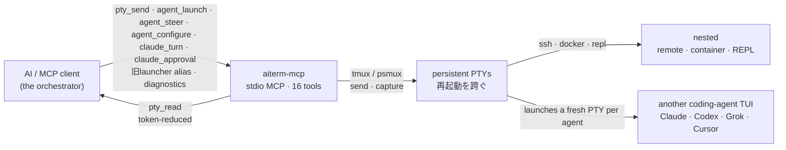

> **任意のMCPクライアントから、Claude Code・Codex CLI・Grok CLI・Cursor Agent CLIを単一のharness APIで永続対話TUIへ起動する。**

<p align="center">
  
  <br>
  <sub><em>この画像は、異なる知性がひとつの持続する実行現場を共有し、それぞれの視点から同じ仕事を前へ進める姿を表しています。</em></sub>
</p>

# Aiterm

[](https://github.com/kitepon/aiterm-mcp/actions/workflows/ci.yml)
[](https://www.npmjs.com/package/aiterm-mcp)
[](https://www.npmjs.com/package/aiterm-mcp)
[](https://nodejs.org)
[](LICENSE)

> *(English: [README.md](README.md))*

> **あなたの AI に、ほかの AI を操らせる。** `agent_launch`の1回の呼び出しで、実行基盤harnessとmodelを別々に選び、永続sessionを受け取る。CursorでGPT／Claude／Grokを選んでも、session・hook・transcriptはCursorが所有する。
>
> **これは何か:** AI が握る 1 本の永続 MCP 端末——その中に他のコーディングエージェントも起動できる。`ssh`・`docker exec`・REPL・別エージェントの TUI は、すべてその 1 本の端末の中へ「送るだけのテキスト」として入れ子になる。仕組みはあえて素朴——MCP クライアントが相手エージェントの端末を 1 ターンずつ操作するだけ。隠れたプロトコルも・aiterm独自の共有メモリ層も・自律的な交渉も無い。起動したagentは、直接CLIと同じproject／harnessの通常memory・設定を読む。
>
> **人が端末に張り付く必要はない。** aiterm は MCP 越しにプログラムから駆動されるので、「AI が別のエージェントを起動して操作する」のに端末の前に誰も座らなくていい——オーケストレーションのループ・CI ステップ・cron から動かせる。
>
> *MCP = Model Context Protocol — Claude Code のようなツールが AI に機能を差し込むためのオープン標準。*

[kitepon.dev](https://kitepon.dev/)のクオが開発・メンテナンスしています。

## MCPクライアントへ導入

cloneもビルドも不要。どのクライアントでも公開パッケージを次のコマンドで起動する:

```bash
npx -y aiterm-mcp
```

**Node.js ≥ 18** と対応multiplexer backend（POSIXは**tmux**、Windows nativeは**psmux 3.3.8以上**）が必要。Codexを操作する場合は、Codex CLIの導入と認証も必要。

### Claude Code

ユーザー設定へ追加する:

```bash
claude mcp add --scope user --transport stdio aiterm -- npx -y aiterm-mcp
```

プロジェクト設定として共有する場合は、`.mcp.json` に次を置く:

```json
{
  "mcpServers": {
    "aiterm": {
      "command": "npx",
      "args": ["-y", "aiterm-mcp"]
    }
  }
}
```

### Claude Desktop

`claude_desktop_config.json` に次のサーバーを追加する:

```json
{
  "mcpServers": {
    "aiterm": {
      "command": "npx",
      "args": ["-y", "aiterm-mcp"]
    }
  }
}
```

### Cursor

プロジェクトでは `.cursor/mcp.json`、全体設定では `~/.cursor/mcp.json` に保存する:

```json
{
  "mcpServers": {
    "aiterm": {
      "command": "npx",
      "args": ["-y", "aiterm-mcp"]
    }
  }
}
```

**所有境界:** 本repositoryはinstall、設定、永続PTY、agent session、state／schema／migration、
diagnostics、recovery、update、releaseを所有します。このREADMEと[製品文書](docs/00_overview.md)だけで
単独cloneから運用できます。[dotagents](https://github.com/kitepon/dotagents)は任意の工場統合、host wire、
製品間compatibilityと統合受入を担当しますが、Aitermを制御せず、runtimeの必須依存でもありません。

**言葉でなく実測で:** 記録済み203テストのベンチマークでは、`pty_read` はコンテキストに載るトークンを生ログの **約 7.1 分の 1** に減らす。しかも pass/fail の判定は畳んでも残る。→ [組み込みシェルツールとの使い分け](#組み込みシェルツールとの使い分け)

16ツール: 6つのPTYツール、正規のagent起動入口`agent_launch`、実行中のCodex／Grokを誘導する`agent_steer`、移行用の旧4alias、`agent_configure`、`claude_turn`、`claude_approval`、`diagnostics`。backendはPOSIXのtmux／Windows nativeのpsmuxなので、MCPサーバやAIクライアントが再起動してもsessionは生き残る。

**v0.28.0では実行基盤harnessとmodelを分離した。** harnessはagent loop・認証・hook・session・transcriptを所有し、modelはその上で選ぶ。Cursor Agent CLIでGPT／Claude／Grokを選んでも完了契約はCursor方式のまま。Composerは別harnessではなく、`harness:"grok-cli", model:"grok-composer-2.5-fast"`で表す。旧4起動ツールは同じ実装へ流れる互換alias。

**v0.25.2ではGrok 4.6を含む同一sessionの連続設定変更を安定化。** Grok Build 1.0.3で
`/model`の成功通知が再描画により消えても、変更前には無かった要求model／effortが常駐footerへ現れた
最終状態を確認する。caller側のretry、再起動、失敗の成功丸めは不要で、`grok-4.6`は従来どおり
明示`model`としてlive catalog照合後に起動・変更できる。

**v0.25.0ではGrok／Composerへ共通launcher制御を同等実装。** 起動時`reasoning_effort`、
`write_scope:"read-only"`の`--sandbox read-only`強制、`agent_configure`による同一session内の
model／effort変更に対応した。明示したGrok／Composer modelとComposer既定modelはPTY作成前に
現在の`grok models` catalogへ照合し、不在時は別modelへ黙ってfallbackせず明示失敗する。

**v0.24.3ではlauncherへ渡す環境変数を現在のMCP processから明示選択できる。** `env_vars`へ
変数名だけを指定すると、aitermは起動時の現在値を読み、存在する値だけをそのagentへ渡す。永続multiplexer
serverがMCP processより先に起動していても、古いserver環境に席identityやworkflow変数を消されない。
あわせてCodex v0.147が長寿命footerへ加える任意`fast`を認識し、idleな`medium fast ·` sessionでも
再描画・再試行・再起動なしに`agent_configure`できる。

**v0.24.2では長寿命Codexでも設定変更を維持。** 起動時headerがcapture範囲外へ流れた後は、
常駐するmodel／effort footerと入力欄でCodexを識別する。idle sessionをそのまま変更でき、
caller側の画面再描画、再試行、agent再起動は不要。

**v0.24.0では起動中agentの設定変更を追加。** `agent_configure`はharness標準操作を使って、
起動中のCodex／Claudeのmodelとreasoning effortを変更する。PTY、harness session、会話contextは維持する。

**v0.23.0では、ローカル完結の別harness向けportable forkを追加した。** どのlauncherでも
`throughline_source_session`と新しいミッションを`prompt`へ渡すと、PTY作成前にローカルの
Throughlineから対象sessionの読み取り専用handoff contextを取得する。返された記憶はそのまま
ミッションの前へ置かれ、元sessionのDB所属は移動もcopyもされない。Throughlineが無い、または
結果が不正／空ならclean launchへfallbackせず明示失敗する。引数を省略した通常起動は従来どおり。

**v0.22.0では4 launcherを完全なプロジェクト共同作業員へ戻した。** 直接CLIを起動した時と同じ
`HOME`、作業tree、harness home、project/user/local設定、MCP、plugin、skill、permission、trust、memory、
session historyをそのまま使う。aitermがlaunchごとに分離するのは完了相関stateだけ。子には
`role=subagent`、親session、delegation depth、lineage、`delegation_allowed=true`を注入する。
孫以降への再委譲は禁止せず、孫はdepth 2と伸びたlineageを受け取る。既存receiptの
`managed_completion`は後方互換fieldとして残るが、意味は「完了相関あり」であり環境隔離ではない。

**v0.21.3ではCodexの完了経路からStop hookを撤去。** Codexの完了通知と最終回答の帰属は、
root rollout transcriptへ永続化される`task_complete.turn_id`をdispatch byte境界以後から観測する。
hookの実行ファイルが壊れたり消えたりしても`aiterm-wait`は座礁しない。v0.21.0では外部agent launcherへ
明示的な`write_scope`能力宣言を追加し、v0.21.3で指定したscopeと実効性がstructured launch receiptへ
確実に残るよう修正した。v0.20.3では、壊れた認証から複数の相関付きClaude／Fable
sessionが同時にloginへ流れる問題を修理し、新規Claude起動はPTY作成前にvendor所有の共有認証を検証する。
v0.20では、待たずに一度だけ観測する
`aiterm-wait --timeout 0` の未完了を、実際に待って終わらなかった`timeout`と区別し、
`running`（exit 5）で返すようにしました。v0.19系では相関済みClaude approval中継を追加し、
複数行shell配送を維持し、native Windowsのfactory diagnosticsを拡張しました。
v0.16/0.17以来、親エージェントはaiterm上で一切ブロックしません:
agent session への send は常に非ブロック dispatch になり、完了待ちは `aiterm-wait` 一本
（exit code が receipt の outcome を映す: 0=done / 3=timeout=未完了 /
4=closed / 5=running=待たない観測）、初回 prompt 付き
launch は structured receipt にコピペ可能な `wait_command` を含む。factory diagnostics と local
runtime-error store は canonical dotagents config の `collection.enabled: true` が明示された
場合だけ収集し、既定OFF、network送信は行いません。tag起点CIのnpm provenance（OIDC Trusted
Publishing）で公開し、GitHub Release が Official MCP Registry を再登録します。

**状態:** 開発継続中 · 現行公開版 **v0.31.2** · 動作対象は Linux · WSL2 · macOS · Windows ネイティブ · MIT · [変更履歴](CHANGELOG.md)。

### 更新と巻き戻し

npm packageが単独配布の正本であり、dotagentsは介在しません。global installは
`npm install -g aiterm-mcp@latest`で更新します。巻き戻す時は
`npm install -g "aiterm-mcp@<known-good-version>"`のように既知の正常versionを明示し、MCP clientを再起動します。
`npx`設定では`aiterm-mcp@latest`へ変えると更新でき、`aiterm-mcp@<version>`へ変えると固定・巻き戻し
できます。downgrade前に[変更履歴](CHANGELOG.md)でstate／schema互換を確認してください。maintainer向けの
公開物とreleaseの巻き戻しは、製品所有の[release手順](docs/RELEASE.md)を正とします。

## なぜ今

2026 のエージェントツールの多くはオーケストレーションへ寄っていっている——先導するモデルが機械的なリファクタを Codex に委ね、一括編集を Composer に走らせながら自分は diff をレビューし、1 つのタスクを複数エージェントに分散して自分のコンテキスト窓を守る。そうしたエージェントはどれも既に端末の中に住んでいる。aiterm はその端末を一級の・MCP ネイティブなツールにする——だから指揮するモデルは、**人がペインを配線しなくても他のエージェントを起動して操れる。**

## 2 つの使い方

### 1. SSH・コンテナ・REPL を 1 本の永続端末で操作する — 土台

これが土台で、platform backend（POSIXのtmux／Windows nativeのpsmux）だけで動く——他の CLI は要らない。`pty_open` がローカル端末を 1 個握り、`ssh host`・`docker exec -it x bash`・REPL は、その中へ `pty_send` で打ち込む「ただのテキスト」——**一度だけ**。以降のコマンドは同じ認証済みセッションを通る。セッション種別をツールで区別しない。

```
pty_open()                         → ローカル端末を 1 個握る
pty_send(id, "ssh 192.168.1.2")    → その端末の中で一度だけ認証して入る
pty_send(id, "uname -a")           → 以降のコマンドは同じセッションを通る
pty_read(id, { wait: true })       → 削減済みの出力を読む（完了検出つき）
```

<sub>**起源.** これのために aiterm を作った。自宅サーバを Claude Code からコマンド 1 個ずつ叩くと、SSH コマンドは毎回「接続→認証→切断」になる——鍵のパスフレーズもワンタイムコードも毎回打ち直し、短命セッションが増殖し、やがて自分の防御（`fail2ban`・`MaxStartups`/`MaxSessions`・アカウントロック）に締め出される——攻撃者を止める仕組みに自分が止められる。1 本の認証済みセッションを握れば 3 つとも一度に消える。この痛みがこの永続端末が存在する理由で、その中に丸ごと別のエージェントを起動するのは、そこから育った姿だ。</sub>

### 2. その端末の中に他のコーディングエージェントを起動する — オーケストレーションの旗艦

同じprimitiveが別エージェントのTUIを宿す。`agent_launch`の`harness`はagent loop・認証・hook・session・transcriptを所有する実行基盤、`model`は独立した選択。起動processは直接CLIと同じproject/user環境を使い、通常config、MCP、plugin、skill、permission、trust、memory、historyをcopy・filter・置換しない。

`aiterm.agent-launch-result.v1`は正規`harness`を返し、旧`provider`は互換fieldとして残す。同じ`harness`はagent dispatch、`aiterm-wait`、`agent_configure`、`pty_list`のagent行にも載り、旧vendor／provider／agent fieldは互換用に残る。Codexは通常rollout、Grok CLIは通常session event、Claudeはlaunch固有Stop hook、Cursorは通常agent transcript末尾の`turn_ended`を完了正本に使う。`pty_send`は非ブロックdispatchで、vendor別完了境界を表すopaqueな整数`event_cursor`を返し、完了通知は`aiterm-wait`を親のターンを塞がない別processで受ける。Cursorのsubmitキーはadapterが現行CLIのextended keyboard protocolへ変換する。送信textがCursorのcomposerへ残った場合は成功receiptを返さず失敗する。

`agent_launch`・`pty_send`（agent dispatch）・`agent_steer`は任意の`image`（画像ファイルの絶対パスの配列。png/jpg/jpeg/gif/webp）を受ける。aitermが本文末尾へ添付行を付け、どのharnessも自分のfile読取toolでそのpathを画像として開く。呼出し側はharness別の添付手順を覚えない。不正なpathは送信前に拒否する。

`agent_launch`は任意の`write_scope`も受ける。Codex／Grokのread-onlyは`--sandbox read-only`、Cursorは公式`--mode ask`で実効化する。path説明は同等CLI引数がないためdeclaration-only。

Grok／Composerの無人起動は公式`--trust`で指定された作業フォルダを信頼登録し、確認画面を完了してから初回promptを送る。この登録はGrok CLIの信頼ストアへ保存され、フォルダ内のhook・MCP・LSPにも適用される。read-only sandboxの制限は維持する。画面に残る完了済みhookの結果は実行中と判定しない。

Grok／Composerがread-only sandboxの適用を拒否した場合、prompt送信時に`GROK_SANDBOX_STARTUP_FAILED`とCLIの原因を返す。例えばhookのパスにシンボリックリンクがあるとGrok CLIは起動を拒否する。設定の管理元で原因を修正し、対象sessionを`pty_close`して起動し直す。Aitermはsandboxを解除したりhookをコピーしたりしない。

この判定はGrok専用アダプターが所有し、同じCLIを使うComposerにも適用する。初回prompt付きの`agent_launch`と通常の`pty_send`で、入力受付待ち中に拒否を検出すると未送信のエラーを返す。promptなしの`agent_launch`は起動要求を返すため、その応答だけでは入力受付済みと判断しない。実装の責務分担は[DESIGN](docs/DESIGN.md#failure-and-recovery)を参照。

```text
agent_launch({ harness: "codex-cli", session_name: "codex1", cwd: "/repo",
              prompt: "port test/legacy.py to vitest",
              model: "gpt-5.6-sol", reasoning_effort: "high",
              write_scope: "test/ only; no commit" })
                                    → { session_id: "codex1", … }   # Codex が永続端末で稼働開始
pty_read("codex1", { screen: true })   → 何をしているか読む（トークン削減）
pty_send("codex1", "also fix the imports it broke")   # 非ブロックdispatch＝event_cursor入りreceipt
$ aiterm-wait --session codex1 --cursor <event_cursor>   # exit 0=done / 3=timeout(未完了) / 4=closed / 7=error(APIエラー等でturn打ち切り)。回収は pty_read(agent_transcript:true)
                                    → 操舵し、Codex の次の入力境界で返る
```

正規のharness選択肢:

| `harness` | 起動するもの | modelの扱い |
| --- | --- | --- |
| `claude-code` | Claude Code CLI | Claude model／effort |
| `codex-cli` | Codex CLI | OpenAI model／effort |
| `grok-cli` | Grok Build CLI | Grok／Composer model、live catalog照合 |
| `cursor-cli` | Cursor Agent CLI | Cursor catalog上のGPT／Claude／Grok等 |

Cursorの`model`は`gpt-5.6-luna`のようなbase model、`reasoning_effort`は`high`のように別指定する。adapterは現行`model-effort` IDを`cursor-agent models`へ照合し、起動中変更はCursor標準model pickerのparameter editorを使う。不在時は別modelへfallbackしない。

`env_vars`は環境変数の**名前**だけを並べるallowlistであり、name/value mapではない。aitermは
launcher起動時に現在のMCP processから各名前を読み、存在する値をshell quoteして、その1回のvendor
起動コマンドへ入れる。未設定名は省略し、shell変数名として不正な名前はsession作成前に失敗する。
全環境の暗黙copy、backend server再起動、retry、fallbackは行わない。値はMCP tool引数には入らないが、
PTYの起動コマンドとして送られ、sessionの`.lastcmd`にも保持されるため、起動先vendorと同じOS userへ
到達する。秘密転送路ではなく、席identityやworkflow用の非secret変数だけに使う。

選んだharnessのCLIを公式経路で導入・認証しておく。Cursorは`curl https://cursor.com/install -fsS | bash`、`agent login`、更新は`agent update`が公式経路で、Aitermは曖昧な`agent`でなく`cursor-agent`を起動する。CLI不在・未認証・不正引数はsession作成前に明示失敗し、別経路へfallbackしない。
GrokのcredentialをAitermがlock、検査、書換えすることはない。継承した`GROK_AUTH_PATH`は空でない
絶対pathで、対象が存在すればそのままGrokへ渡す。内容・権限・linkの扱いはGrokが所有する。
既定auth fileの不在を許すのは`XAI_API_KEY`設定時だけである。

portable forkは任意である。`throughline_source_session`を使う場合、`prompt`は必須の新ミッションとなり、
`launch_operation_id`とは併用できない。aitermは`THROUGHLINE_BIN`、次に`PATH`からThroughlineを解決し、
`throughline handoff-context --session <id> --json`のcontextを固定区切りとミッションの前へそのまま置く。
任意の`throughline_supplement_file`はThroughline 0.10.8以降を必要とし、`--supplement-file <path>`として内容を読まずにそのまま渡し、
project束縛・検証・予算配分はThroughlineだけが所有する。この経路だけ`throughline >= 0.9.0`が必要で、元sessionのDB所属は変わらない。引数省略時には
Throughline自体が不要である。

エージェント間の隠れたプロトコルは無い。起動したharnessは利用者がattachできるもう1本の永続sessionであり、MCPクライアントが通常のPTY操作で駆動する。

## デモ

<p align="center">
  
</p>

リポジトリ内で今このツールに実際に通した本物の採取——数値も省略マーカーも各 `is_complete` の判定も、すべてツール自身の出力で、モックではない。角括弧のメタ行は `pty_read` が実際に付けるもの（この日本語 README ではメタ行を実出力のまま載せている。英語版は可読性のため訳出している）。

長い出力を head+tail に畳む——中間を省いているのは私でなく reducer（166 → 56 トークン）:

```text
→ pty_send("demo", "seq 1 150")
→ pty_read("demo", { wait: true })
← 1
  2
  3
  ⋮  （head は 29 行目まで続く——この README では省略表示）
  … 〈102 行省略。全文は full=true、範囲は line_range="A:B"〉 …    ← ツール自身のマーカー
  ⋮  （tail は 132 行目から再開——この README では省略表示）
  149
  150
  [aiterm demo: 51 行 / ~56 tok (raw 152 行 / ~166 tok); 102 行 hidden] [is_complete=True via quiescent]
```

`grep` を、コマンド別 reducer で「件数ヘッダ＋ヒット行だけ」に畳む:

```text
→ pty_send("demo", "grep -rn capture-pane src/ test/")
→ pty_read("demo", { wait: true, rtk: true })
← 2 matches in 1 files:

  src/core.ts:159:// maxBuffer は既定 1MiB。capture-pane（大きなスクロールバック）… （行はここで truncate）
  src/core.ts:335:const args = ["capture-pane", "-p", "-J", "-t", name];
  [aiterm demo: rtk:grep 適用 / ~46 tok (raw ~53 tok)] [is_complete=True via quiescent]
```

ネストは「中へ送るただのテキスト」——同じ PTY の*中で* Python REPL に入る（`ssh host`・`docker exec -it … bash`・起動したコーディングエージェントの TUI も、まったく同じ要領でネストする）:

```text
→ pty_send("demo", "python3")
→ pty_read("demo", { until: ">>>" })              # 入れ子側のプロンプト = 「内側シェルが応答できる」
→ pty_send("demo", "print(sum(range(1_000_000)))")
→ pty_read("demo", { wait: true, until: ">>>" })
← 499999500000                                     [is_complete=True via until]
```

上の採取で私が触ったのは 2 本の `⋮` 行（長い head/tail を README 用に省略）と長すぎる grep 行 1 本の truncate だけ——`〈…〉` マーカー・トークン数・各 `is_complete` はツールが出した通り。（`until` は末尾スペース無しの `">>>"` を使う——採取されるプロンプトは末尾が削られるので `">>> "` だと外れて `timeout` に落ちる。）ネスト中は `until`（内側プロンプト）か `mark: true` を渡すこと——そこでは quiescence が原理的に効かないため（[完了検出](#完了検出5-層) / [既知の制約](#既知の制約バグではなく仕様)）。同じmultiplexer backendに人が `attach` すれば、これらをライブで覗ける（[人が覗く](#人が覗く)）。

## 最初の実行（約60秒）

Claude Code を再起動して、接続を確認:

```bash
/mcp        # aiterm が connected・16 ツール公開、と出る
```

最初のセッション——4 回の呼び出しで、1 個の永続端末:

```text
pty_open()                          → { session_id: "t1", attach: "<platform attach command>" }
pty_send("t1", "echo hello")        → PTY にコマンドを送る
pty_read("t1", { wait: true })      → "hello"   （トークン削減・完了検出つき）
pty_close("t1")                     → 端末を解放
```

`pty_close` は冪等で、`closed` / `already_closed` のstructured receiptを返す。
MCP応答を失ったdurable callerも同じ`session_id`への再試行だけでclose結果を確定できる。

これだけ。`t1` の端末は本物で永続——`ssh`・`docker exec`・REPL・起動したエージェントのTUIは、そこに住む「もの」に過ぎない。ワーカー起動も1コールで、`agent_launch({ harness: "codex-cli" })`が返す`session_id`を同じ`pty_read`／`pty_send`で操作する。

**グローバル導入や別クライアントが良い場合は:**

```bash
# グローバル導入してコマンド名で登録
npm i -g aiterm-mcp
claude mcp add --scope user --transport stdio aiterm -- aiterm-mcp
```

`~/.claude.json` に登録され、初回に承認プロンプトが出る。クライアント別のJSONは[MCPクライアントへ導入](#mcpクライアントへ導入)を参照。

## ヘッドレス: 端末に人が居ない

MCP クライアントが aiterm を stdio 越しにプログラムから駆動するので、上のすべては **端末に誰も座らないまま**動く。任意のMCP対応統括役が、自分と同じharnessを含む`agent_launch`を呼び、`pty_read`で結果を読んで次へ進める——無人で。これは、人が操作する端末が向かない場所にこそ aiterm が合うということ:

- **複数エージェントのオーケストレーション** — 統括役がサブタスクを Claude Code / Codex / Grok / Cursor harnessへ渡し、各々を専用の永続セッションに置き、全部を読み戻す。ComposerはGrok CLIのmodel presetとして扱う。
- **CI** — ジョブのステップがエージェントを起こし、操作し、片付けられる。
- **cron** — スケジュール実行がエージェントを起動して出力を回収できる。

端末は本物で共有されているので、人が*割り込むことも*できる（[人が覗く](#人が覗く)）——が、人を必要とはしない。

## 仕組み



primitive は「PTY を 1 個握る」ことだけ。それ以外——SSH・コンテナ・REPL・起動したエージェント TUI——は、永続端末の中で動く「対話的な何か」に過ぎず、同じ `pty_send` / `pty_read` で操作する。各起動ツールは自分専用の新しい PTY を開く。PTY はPOSIXのtmux／Windows nativeのpsmux上にあるので、MCP サーバや AI クライアントが再起動してもセッションは生き残る。

## 組み込みシェルツールとの使い分け

MCP クライアントには最初からシェルツールが付いている。軽い用事はそれで足りるし、aiterm が活きる場面は別にある。その線引きを、同じコマンドで両方に通して確かめた。トークンの数え方は両側で揃えてある（文字数 ÷ 4、aiterm が実際に使う見積り式）ので、比較はフェアだ。

ちょっとしたコマンドなら、組み込みツールのほうが速い。`git log --oneline -5` を 1 回で返すのに対して、aiterm は `pty_send` と `pty_read` で 2 回のやり取りが要る。この 1 往復ぶんの差が、軽いコマンドではそのまま損になる（~7 秒 vs ~13 秒）。

出力が長いとき、あるいは状態を次の呼び出しへ持ち越したいときに、この 2 往復目が元を取る。

| コマンド | 組み込みシェル | aiterm | 判定 |
| --- | --- | --- | --- |
| `git log --oneline -5` | 1 回・~7 秒 | 2 回・~13 秒 | **シェル**（往復が少ない） |
| `npm test`（203 テスト） | ~4,292 tok | ~607 tok | **aiterm**（判定は残る） |
| `find node_modules -type f` | ~500 tok¹ | ~456 tok | 互角。aiterm は先頭も末尾も残す |
| `grep -rn "session" src/` | ~2,989 tok | ~1,096 tok | **aiterm**（長い行は切られる²） |

例えばこのリポジトリの 203 テストを走らせてみる。組み込みツールはログ 223 行をまるごと——~4,292 トークン——コンテキストに流し込む。aiterm は同じ出力を head+tail に畳んで ~607 トークンまで縮める。

```text
[aiterm demo: 51 行 / ~607 tok (raw 223 行 / ~4292 tok); 172 行 hidden] [is_complete=True via mark]
```

モデルに読ませるトークンは約 **7.1 分の 1** に減る。それでも判定は残る。畳んだ後の tail に `ℹ tests 203 / ℹ pass 203 / ℹ fail 0` がちゃんと載っている。削れたのは繰り返しのノイズで、ログを開いた目的の行は生きている。実行時間はほぼ同じなので、これだけ長いコマンドになると 2 往復の差は誤差に埋もれる。

aiterm はセッションの状態も持ち越せる。組み込みツールは呼び出しごとにまっさらなシェルを立てるので、cwd は毎回プロジェクト直下に戻り、環境変数も引き継がれない。試しに `cd /tmp && export BENCH_VAR=hello123` を送って、別の呼び出しで読み返してみる。

```text
組み込みシェル  →  var=                   # 空。env は消え、cwd はプロジェクト直下に戻る
aiterm          →  cwd=/tmp var=hello123  # 1 本の永続PTYが両方を保つ
```

cd でディレクトリを移り、環境変数を立て、ビルドを走らせる。ssh で一度ログインして、その接続のまま 10 個コマンドを打つ。REPL や起動したエージェントの TUI を 1 ターンずつ操作する。こういう流れは、1 本の永続PTYが状態を握っていて初めて成り立つ。端末に何かを覚えておいてほしいときは、aiterm を使う。

<sub>¹ いまのハーネスは ~192 KB の出力をいったんファイルに逃がして、先頭 ~2 KB だけを見せる。そのためトークン数はほぼ並ぶ。aiterm は行数を正確に返すうえ、あとから `line_range="A:B"` で好きな範囲（先頭でも末尾でも）を取り出せる。² `rtk` の grep 縮約は長い行（~80 字）を切り詰めて、あふれを `[+N more]` にまとめる。ざっと眺めるには向くが、全行をそのまま読みたいときは組み込みツールを使う。</sub>

## 既存手段との比較

aiterm は 2 つの系譜の交点にいる——端末を操作する MCP サーバと、より新しい「エージェント同士が共有端末越しに会話する」という発想（[aiterm の立ち位置](#aiterm-の立ち位置)参照）。各軸の並びはこうなる——相手が強い所も含めて、正直に。

|  | **aiterm-mcp** | 1 コマンド毎の往復<br/>(例: `mcp-server-commands`) | terminal / SSH / tmux MCP<br/>(例: `iterm-mcp`, `ssh-mcp`, `tmux-mcp`) | 共有 tmux でエージェント同士<br/>(例: `smux`) |
| --- | --- | --- | --- | --- |
| 永続セッション | ✅ tmux / psmux・再起動を跨ぐ | ❌ 毎回新シェル | ⚠️ まちまち | ✅ tmux |
| SSH / コンテナ / REPL | `pty_send` 1 回でネスト | 毎コマンド接続し直し | ⚠️ ツールが分かれがち | ✅ tmux（人が操作） |
| 1 コールで別エージェント起動 | ✅ `agent_launch(harness=…)` | ❌ | ❌ | ⚠️ 人が動かす tmux に CLI + skills で参加 |
| ヘッドレス（人が tmux に居ない） | ✅ MCP 駆動・プログラム的 | ✅ | ⚠️ まちまち | ❌ 人が tmux に居る前提 |
| MCP ネイティブ（任意の MCP クライアント） | ✅ `claude mcp add` 1 行 | ✅ | ✅（MCP なので） | ❌ tmux 設定 + CLI + Agent Skills |
| トークン削減読取 | ✅ コマンド別 reducer | ❌ 生出力 | ⚠️ ほぼ無し | ❌ 生 tmux |
| 完了検出 | 5 層: 終了 / `mark` / `until` / 静止 / timeout | 無し（毎回ブロック） | ⚠️ プロンプト一致・脆い | ❌ エージェントがペインを読む |
| 人が同時操作 | ✅ 共有socket／namespace（`attach`） | ❌ | ⚠️ まちまち | ✅（設計の芯） |

## aiterm の立ち位置

「エージェント同士が共有端末越しに会話する」は、それ自体が 1 つのカテゴリになりつつある——そして本当に良い発想だ。端末はどのコーディングエージェントも既に話せる普遍インタフェースで、専用のエージェント間プロトコルは要らない——シェル*そのもの*が共有面になる。`smux`（by @shawn_pana）はこの発想を、人が用意する 1 コマンドの共有 tmux 環境として広め、エージェントは `tmux-bridge` CLI と Agent Skills でそこに参加する。人が輪の中にいる共有ペインのワークフローに強く、実際に支持を集めている。

aiterm は同じ核心の洞察——端末を出会いの場にする——を取り、あえて 3 つの違う選択をした:

1. **ヘッドレスが前提。** aiterm は MCP 越しにプログラムから駆動されるので、「AI が別のエージェントを起動して操作する」のに *tmux に人が座らなくていい*——オーケストレーションのループ・CI ステップ・cron から動く。共有 tmux 系は人がキーボードの前に居ることを主軸にしていて（ドキュメントも対話的なペイン操作が中心）、無人運用は本来の姿ではない——aiterm はそれが本来の姿だ。
2. **MCP ネイティブ＝採用させるワークフローではない。** aiterm は stdio MCP サーバ: `claude mcp add` 1 行で、stdio を話す任意の MCP クライアントに構造化ツールとして刺さる（実機確認は Claude Code。Cursor / Cline / Claude Desktop も同じプロトコルなので同様に動くはず）。tmux 設定の採用も・ペイン操作の習得も・skills の導入も求めない——クライアントは既にツール呼び出しの仕方を知っている。
3. **エージェント起動が 1 ツールコール＝オーケストレーションの primitive。** `codex_agent()` が Codex を永続端末に起こし、すぐ操作できるセッションを返す。ペインを手で並べたり貼り付けたりしない——起動も・操舵も・読取も、指揮するモデルが自分で打てるツールコールだ。

その上に、生の tmux ブリッジには無い製品化レイヤが乗る: **トークン削減読取**と**5 層の完了検出**。これらは人が tmux に居るモデルを否定しない——人がどこに立つかについての、別の・補完的な賭けだ。

## ツール

| ツール | 役割 | 主な引数 |
| --- | --- | --- |
| `pty_open` | 端末を 1 個握り `session_id` を返す | `name?`, `shell="bash"` |
| `pty_send` | テキストを送る。agent sessionでは非ブロックdispatchとして`event_cursor`を返す | `session_id`, `text`, `enter=true`, `mark`, `force`, `rtk`, `raw` |
| `pty_read` | 出力を削減して読む（既定は増分） | `session_id`, `wait`, `until`, `until_regex`, `timeout`, `screen`, `full`, `lines`, `line_range`, `raw`, `rtk`, `agent_transcript`, `operation_id` |
| `pty_key` | 制御キーを送る | `session_id`, `key`（`C-c`/`Enter`/`Up`…） |
| `pty_close` | 冪等に閉じ、`closed` / `already_closed`を返す | `session_id` |
| `pty_list` | セッション一覧（agent行は正規`harness=<id>`と互換`agent=<kind>`を含む） | （なし） |
| `agent_launch` | harnessとmodelを別軸で選ぶ正規agent起動入口 | `harness`, `prompt?`, `model?`, `reasoning_effort?`, `cwd?`, `write_scope?`, `throughline_source_session?`, `throughline_supplement_file?` |
| `agent_steer` | 実行中のCodex／Grok turnへtextを差し込む。idleなら送信せず`idle`を返す | `session_id`, `text` |
| `claude_agent` / `codex_agent` / `grok_agent` / `composer_agent` | deprecated互換alias | 旧launcher引数 |
| `agent_configure` | 起動中のClaude／Codex／Grok／Composer／Cursorを再起動せずmodel／effort変更 | `session_id`, `model?`, `reasoning_effort?` |
| `claude_turn` | 相関済みClaude operationをdispatch（issue）または回収（recover） | `action`, `session_id`, `operation_id`, `text?` |
| `claude_approval` | 現在表示中の相関済みClaude承認UIを検査または応答 | `action`, `session_id`, `operation_id?`, `approval_choice?`, `observed_prompt_digest?` |
| `diagnostics` | 機械可読 JSON による read-only factory readiness | （なし） |

`diagnostics` は PTY やエージェントを起動しない。パッケージ版、MCP 呼出 readiness、read-only な PTY 一覧要約、bounded runtime-error-store status、任意 vendor launcher の可用性だけを返す。path・環境値・認証情報・コマンド本文・PTY 出力・raw log は意図的に返さない。通常未設定の任意依存は `not_applicable`、安全に確定できない状態は `unverified` と表す。

### ローカル runtime error snapshot

`aiterm-runtime-errors snapshot` は dotagents factory adapter 向けに、製品所有のローカル snapshot を機械可読 JSON で返す。canonical dotagents factory-reporter config が schema-exact、host profile が実行 OS と一致し、`collection.enabled` が JSON boolean `true` の時だけ収集する。reporting field は schema 検証するが endpoint/credential file へ接続・読取せず network I/O も行わない。観測 API は core owner layer の固定3 code（PTY dependency・persistence・任意 vendor launcher）だけを受け、保存するのも固定 template と aggregate metadata（SHA-256 fingerprint、count、first/last、status、monotonic sequence）だけ。exception、stderr/stdout、stack、prompt、PTY/transcript/event body、path、任意 context は受け付けない。保存済み JSON も top/record exact・固定定義一致・fingerprint 再計算を通し、明示 DTO だけを返す。

consumer は `aiterm-runtime-errors snapshot` を読み、durable ingestion 後に `aiterm-runtime-errors ack --cursor N` を呼ぶ。運用上の明示操作は `resolve|reopen --fingerprint SHA256`。MCP からの収集・diagnostic read は timeout 付き child process に隔離し、FIFOや停止 filesystem が端末本体を止めない。store mutation は期限付き bakery ticket queue で直列化する。各waiterは PID＋process start identity＋owner token を持つ再利用されない固有ticketを所有するため、死んだownerだけを固有名で除去でき、固定path回収のABAを作らない。queueの期限は正常な前任者を含む総待ち時間ではなく、同じ先頭ownerが進まない時間を測る。通常pollはprocessの生存確認だけを行い、process start identityはblockerがstallした時に照合する。POSIX state は `$XDG_STATE_HOME/aiterm-mcp/`（既定 `~/.local/state/aiterm-mcp/`）へ atomic replacement で置き、every read で owner/mode を再検証する。Windows native は `%LOCALAPPDATA%\aiterm-mcp\` で current SID の非継承 FullControl ACE 1件だけへ DACL を再構築し readback する。今回 Windows は path/DACL/timeout の純粋テストだけであり、新しい実機統合成功は主張しない。

### 対話エージェントharness

`agent_launch`は選んだharnessの対話TUIを新しい永続PTYに起動し、`session_id`を返す。harnessはagent loop・認証・hook・session・transcriptを所有し、modelは独立。以後は他sessionと同じ`pty_read`／`pty_send`で操作する。

`agent_configure({ session_id, model?, reasoning_effort? })`はharness標準操作で起動中のClaude／Codex／Grok／Composer／Cursorを変更し、PTYと会話contextを維持する。

| `harness` | 起動するもの | modelの扱い |
| --- | --- | --- |
| `claude-code` | Claude Code CLI | Claude model／effort |
| `codex-cli` | Codex CLI | OpenAI model／effort |
| `grok-cli` | Grok Build CLI | Grok／Composer model、live catalog照合 |
| `cursor-cli` | Cursor Agent CLI | Cursor catalog上のGPT／Claude／Grok等 |

対応するCLI（`claude`／`codex`／`grok`／`cursor-agent`）の公式導入・認証が必要。前提違反はsession作成前に明示失敗する。全harnessが通常project/user環境と同じ非ブロックdispatch契約を使う。

`throughline_source_session`と空でない新ミッション`prompt`を指定すると、Throughlineの読み取り専用
handoff contextを前置きできる。この任意経路は`throughline >= 0.9.0`を必要とし、
`launch_operation_id`とは併用不可で、元sessionのDB所属を変更しない。Throughlineは
`THROUGHLINE_BIN`、次に`PATH`から解決し、不在・不正・空のexportはPTY作成前に明示失敗する。
任意の`throughline_supplement_file`はThroughline 0.10.8以降と`throughline_source_session`を必要とし、Aitermは内容を解釈せずThroughlineへ渡す。

エージェントの回答が画面tailより長ければ、`pty_read({ agent_transcript:true })`で再promptなしに全文回収する。既存の人間向けcontentは診断suffixを維持し、機械呼出し側は`aiterm.pty-read-result.v1`の`structuredContent.text`から回答本文だけを取得する。Claudeはlaunch相関Stop hook、Codexは通常rollout、Grokは最後の実user行以後の最後の空でないassistantメッセージだけ、Cursorはlaunch IDでbindした通常agent transcriptから同じturnを回収する。

### 完了検出（5 層）

`pty_read({ wait: true })`は通常PTYを、process終了／`mark:true` sentinel／`until`一致／shell復帰を伴う出力静止／timeoutの5層で判定する。agent sessionは第6の正確な層を使い、Codexは通常rollout、Grokは通常session event、Claudeはlaunch相関Stop event、Cursorは通常agent transcriptの`turn_ended`を`aiterm-wait --cursor`が観測する。親はブロックもポーリングもしない。

### トークン削減

- `pty_read` は既定で制御文字除去・連続重複圧縮・head+tail 折りたたみ（＋復元ヒント・メタ併記）をかける。
- `pty_read({ rtk: true })` は直前に送ったコマンド別の reducer（`git status`/`git log`/`grep`/`pytest` ほか）で観測出力をさらに縮約する（rtk バイナリ非依存・自前実装）。
- `pty_send({ rtk: true })` は既知コマンドを `rtk` 形に書き換えて送り、実行先に `rtk` があればソースで削減を効かせる（無ければ素通し）。

### 入出力

`pty_send` はコマンドやpromptの意味を判定せず、指定された本文を端末へ送る。既定ではESC・ブラケットペースト終端などをサニタイズし、`pty_read`も制御文字を無害化して返す（`raw: true`はそのまま扱う）。コマンドの許可・拒否はshell、接続先、起動したharnessが所有する。

1回の `pty_send` が受理する本文はUTF-8で最大64KiB。同一sessionへの送信はaiterm processをまたいで直列化し、chunk同士の混線を防ぐ。全OSで長いPTY入力の欠落を避けるためplatformのmultiplexerへUTF-8境界を壊さない256-byte単位でpasteし、chunk間に10msのdrain間隔を置く。POSIX shellが前面にいる時のsanitize済み複数行は、改行を含まない単一の`eval`入力へ符号化する。shellがscript全体を所有してから先頭行を実行するため、途中で起動したpager／REPLが後続行を対話キーとして奪わない。単一行、`raw:true`、非shell前面は従来どおり直接PTYへpasteする。agent dispatchはtmux互換のbracketed paste操作（`paste-buffer -p`）を使う: bracketed paste modeを要求しているpaneへは各chunkを`ESC[200~/201~`で包んで届け、chunk投入中のキー解釈による語中文字化け・submit取り落としを抑える。途中chunkが失敗した場合は部分送信済みであることを明示し、自動でEnterを押さない。送信processの異常終了でlockが残った場合は送信前にfail-closedする。`pty_list`で対象sessionを確認し、`pty_close`で閉じてから同じsession IDを作り直す。公開の一括停止toolは存在しない。

## 人が覗く

セッションは共有tmux socket（Windows nativeはpsmux namespace）上にある。`pty_open`／`agent_launch`の戻り値に表示されるattachコマンドで、人間がClaude／Codex／Grok／Cursor harnessの同じ端末へ入り、途中でキーボードを引き取れる。

## 要件

- **Node.js >= 18**
- **tmux または psmux**（実行時の前提）
  - **macOS / Linux / WSL2** は tmux を直接使う。macOS は同梱されないので `brew install tmux` で導入する。MCP クライアントがターミナルでなく **GUI から起動**された場合、Homebrew の bin（Apple Silicon: `/opt/homebrew/bin`、Intel: `/usr/local/bin`）が `PATH` に入らないことがある。その場合 aiterm が自動で探索するか、**`AITERM_TMUX=/path/to/tmux`** で明示指定する。
  - **Windows ネイティブ**は WSL を使わず、tmux CLI互換の [psmux](https://github.com/psmux/psmux) **3.3.8以上**をAitermのterminal/session multiplexer backendとして使う（`winget install marlocarlo.psmux`）。**psmuxはshellではない。** `pty_open`の既定shellはPowerShell 7（`pwsh.exe`）で、Windows PowerShell 5.1・PowerShell 6・`cmd.exe`へfallbackしない。5.1しかなければMicrosoft公式installer／package managerで7を導入してから使う。Git for Windowsはharness launcherが内部で明示するBash shell用に引き続き必要。解決先は **`AITERM_PSMUX`**／**`AITERM_BASH`** で上書きできる。他製品はpsmuxへ直接依存せず、永続端末をAiterm公開APIから利用する。
- **agent harness**を使う場合: 対応CLIを製品所有者の公式経路で導入・認証する。CursorはmacOS／Linux／WSLで`curl https://cursor.com/install -fsS | bash`、Windows nativeで`irm 'https://cursor.com/install?win32=true' | iex`を使い、`agent login`で認証、`agent update`で更新する。Aitermは`cursor-agent`を起動する。portable forkだけは追加で`throughline >= 0.9.0`が必要。
- 任意: [`rtk`](https://github.com/rtk-ai/rtk) バイナリ（`pty_send` の `rtk: true` 委譲で使う。無くても動く）

## 既知の制約（バグではなく仕様）

- **ネスト中（ssh / docker / REPL / 起動したエージェント TUI）は quiescence が原理的に効かない。** 前面コマンドがシェル集合（bash/sh/zsh/fish/dash）の外になるため。ネスト中で `until` も `mark` も無いときは、待っても完了を確定できる信号が無いので、`pty_read({ wait: true })` はフル `timeout` を空費せず出力静止時点で `is_complete=False via nested` と早期に返し、`until`（既定リテラル部分一致・`until_regex: true` で正規表現）か `mark: true`（終了コード付き sentinel・自動検出）の指定を促す。全画面のエージェント TUI なら、出力が落ち着いた時点で `{ screen: true }` を読む。
- **`is_complete=False` は失敗ではない。** 「timeout 内に完了を観測できなかった」という意味。長時間コマンドでは `timeout` を伸ばすか `until`/`mark` を使う。
- **agent harnessは実物TUIを起動し、model APIを代理しない。** model・認証・挙動は選んだharnessのもの。隠れたagent間protocolはなく、MCPクライアントがClaude／Codex／Grok／Cursor TUIへ入力を送り出力を読む。
- **`pty_send({ rtk: true })` は単行コマンドのみ＋外部 `rtk` バイナリが必要**（無ければ素通し）。一方 `pty_read({ rtk: true })` の reducer は自前実装で rtk 非依存。
- **`pytest` reducer は件数・罫線・`FAILURES` ブロック整形が rtk 0.42.0 と byte 一致**（回帰テストで固定）。ただし `-ra`/`-rf` 時の `FAILED` 要約行の理由は**全文を保持する**（rtk 0.42.0 は最初の `" - "` 区切りで切るが、本実装は可読性優先で情報を残すため、この行は意図的に rtk と完全一致させない）。rtk が大出力時に付ける `[full output: …]`（tee ポインタ）行は read 側では再現しない。
- **tmux は `-f /dev/null` 起動**なので `~/.tmux.conf` を読まない（環境差を排除するため）。
- **全セッションが単一multiplexer endpoint（POSIXは`claude.sock`、Windows nativeは1つのpsmux namespace）を共有する。** platformの`kill-server` commandは全セッションを消す。

## 開発

```bash
npm install
npm run build      # tsc → dist/
npm test           # build してから node:test 回帰スイート（tmux または psmux 必須）
npm link           # ローカルで `aiterm-mcp` を PATH に
```

開発中は変更に直結する試験を先に実行する。GitHub Actionsは共通実装・CI自身・未分類の変更をMac・Linux・Windowsで検証し、
Windows固有だけの変更はLinuxとWindowsを選ぶ。版番号だけの変更はLinuxの配布情報・pack確認、文書だけなら文書検査を行う。
試験内容とOSの選択、週次・手動実行の範囲は[公開手順](docs/RELEASE.md)に従う。
`npm run release -- <version>`がversion同期・commit・tag・GitHub Releaseを一回で行い、tag起点のnpm公開は
tagged commitが`origin/main`の祖先であることだけを確認して、他のCI結果を待ちません。

共通進行は`src/core.ts`、harness固有は`src/harnesses/`、OS差は`src/tmux-runtime.ts`／`src/agent-resolver.ts`、reducerは`src/rtk.ts`、公開面は`src/index.ts`が所有する。現行設計は[`docs/DESIGN.md`](docs/DESIGN.md)、release手順は[`docs/RELEASE.md`](docs/RELEASE.md)を正とする。`prototype/python/`はreducerの歴史的移植元であり、pytest reducerは本家rtk 0.42.0と一致する（上記の`FAILED`行の差異だけは意図的・回帰テストで固定）。

## 試す

1 コマンド、clone もビルドも不要:

```bash
claude mcp add --scope user --transport stdio aiterm -- npx -y aiterm-mcp
```

aiterm が、あなたの AI に別のエージェントへ仕事を渡させたなら——あるいはトークンの往復を 1 回でも省けたなら——**[リポジトリに star](https://github.com/kitepon/aiterm-mcp)** を。他の人に見つけてもらう一番安い方法です。

- **npm:** https://www.npmjs.com/package/aiterm-mcp
- **Issue / バグ報告:** https://github.com/kitepon/aiterm-mcp/issues

## ライセンス

MIT
