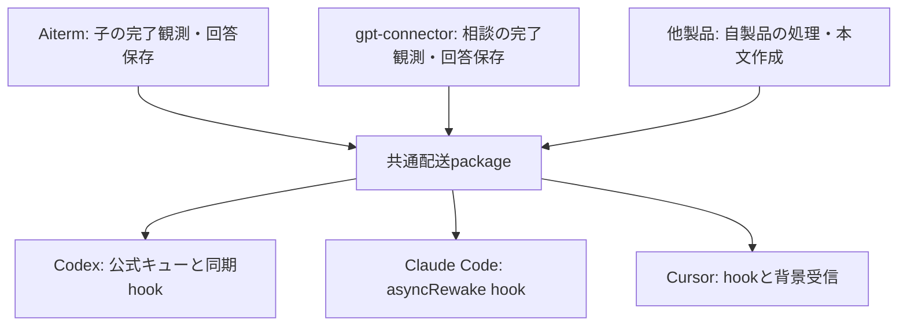

# ADR 0073: 稼働済みAitermから親配送の共通モジュールを抽出する

状態: 設計。製品実装・依存追加・設定変更・移行・releaseは未実施。

## 1. 基準と目的

オーナーの指定により、現在正常稼働しているAitermを聖典とする。
配送の挙動、状態遷移、失敗の扱い、導入順序の正本はAitermであり、他製品との差分はAitermへ揃える。
抽出時にAitermの方式を再設計したり、他製品の方式を混ぜたりしない。

目的は、製品が親AIへの配送を実装するたびに、会話相関、稼働中の差し込み、終了後の再開、
hook登録と承認、OS適合を作り直すことをなくすことにある。
既存の製品入口から同じ配送を利用でき、修理と上流対応の実装を一か所で保守できることを完成条件とする。

調査したソースの固定点は次のとおり。これは設計の出典であり、現行版の一覧ではない。

| 対象 | 調査commit |
| --- | --- |
| Aiterm・抽出の正本 | `8cfe1da43a28606ccb53acd1dbfcc0607436add0` |
| gpt-connector・移行先の比較 | `c7485b47f7551650104786fcb74ad5e0d8b5b15d` |

設計を統合する際に、共有mainの`9673442`までの後続差分も確認した。
追加内容は子の観測・送信判定等で、上表を根拠とする親receiver・hook・setupの抽出境界に変更はない。
実装時にAitermの配送関連へ後続変更があれば、その実物と既存検証を照合して抽出元に含める。
以下のAPIは設計上の識別子であり、公開済みAPIではない。

## 2. 配布と責務

独立repositoryのNode.js／TypeScript ESM packageとする。文書内の仮称は`parent-delivery`とし、
公開名とrepository名は作成時に確定する。Node.jsの下限はAitermの契約を維持する。
各製品が通常のnpm依存として取り込み、製品のsetupが共通setupを呼ぶ。
DLLに相当する役割を、各製品のprocessから読み込むJavaScriptライブラリとして提供する。
hook用の別processも同じpackageの実装を呼ぶ。共有するのは実装であり、製品同士のメモリやstateではない。
独立MCP server、常駐service、共有daemon、配送用の追加ネットワークserviceは設けない。



| 共通packageが所有する実装 | 各製品が所有する実装・データ |
| --- | --- |
| MCP呼出元と公式hookから親を識別・検証する | MCP server、toolの業務処理、子の起動・相談の実行 |
| 親へ本文を送り、受信方式ごとの受付結果を返す | 完了観測、結果本文の作成、依頼と回答の台帳 |
| hookの相関・claim・出力・不明状態を扱う | 同じ子への連続依頼、回答確保、jobの排他的取得 |
| 配送用stateの形式・読書き・互換性 | 製品専用のstate保存場所と製品のjob schema |
| 配送hookの導入・承認・読戻し・解除・診断 | 製品setupの入口と公開receiptの表示 |
| 配送に必要なbinary探索・process識別・shell引用 | PTY、tmux／psmux、transcript、認証、model選択 |

`ParentDeliveryManager`を丸ごと移さない。同クラスが持つ子の予約、turn境界、remote子の観測、
本文確保、MCP再接続後のjob回収はAitermの責務である。共通packageへ渡すのは確定した本文である。
gpt-connectorの相談監視と台帳も同様に残す。

## 3. 共通化しても維持する配送契約

「親が稼働中なら現在の作業へ差し込み、待機中なら同じ会話へ届ける」という目的を、
Aitermが持つ各受信方式で満たす。稼働状態を利用AIに判定させない。

| 親 | 宛先の根拠 | Aitermから継承する配送 |
| --- | --- | --- |
| Codex | MCP client名、要求の`_meta.threadId`、実際のCodex home | 公式キューへ一度投入。同期`PostToolUse`が同じturnへ取り込み、`Stop`が終了時に継続させる。未取得分は公式キューがidle時に通常配送する |
| Claude Code | `PreToolUse`の実sessionと要求の`claudecode/toolUseId` | `PostToolUse`の`asyncRewake` hookが本文を出力しexit 2で通知する。`SessionEnd`で旧依頼を閉じる |
| Cursor | tool結果の配送IDと公式hookの`conversation_id` | 次のtool返りへ`additional_context`で差し込む。idle時は親がreceiptの`wait_process`を背景起動し、同じ配送の本文を受け取る |

Codexは「先にbusyを調べ、別々の送信APIを選ぶ」処理を追加しない。
queue投入とhookの取込みという現在の方式が、turn終了との競合も扱う。
hookの所有確認、全ページ読取り、hard linkによるclaim、`deleted:true`の確認、本文hash照合を維持する。
利用者や他製品の入力は取り込まない。

Claudeは起動時のsession環境変数を宛先に代用せず、`/clear`前の回答を別会話へ送らない。
CursorはMCPに会話IDが届くと仮定せず、結果を返した後にhookが会話へ束縛する。
Cursorのhookと背景受信は現在の`claim.json`を共有し、本文を二重に出さない。
共通packageの背景processを単独起動しただけで親が起きるとは扱わない。親の背景toolへ登録する契約を維持する。

既存の制限も抽出対象の契約に含める。

- CodexのSteer選択はmacOS／Windows。Linuxは現行のキュー配送を維持し、Steer選択には既存の`unsupported`を返す。
- Codex native subagent、Claudeの`agent_id`付き会話など、Aitermが拒否する親は同じ理由で拒否する。
- Cursorの識別対象はAitermが認識するclient。Cloud等や未検証のclient名を推測で追加しない。
- Grok等の親が使うAitermの一般`wait_process`と公開readerは従来どおり製品が提供する。Grok専用のnative親receiverを新設した扱いにしない。
- 明示選択したSteerのhook不備はエラーにする。キュー単品の明示選択と、失敗時の黙示切替を区別する。

## 4. 組込みAPI

公開SDKは製品がプログラムとして呼ぶ。親AIへ追加のMCP toolや配送先入力を要求しない。
製品ごとに一度作る`ProductProfile`には、製品ID、表示名、setup案内、専用state root、
MCP server名とdispatch tool集合、同梱するhook／受信entrypointを渡す。
これは製品の識別情報であり、busy判定、shell引用、hookの種類、queue操作のcallbackは受け取らない。

```ts
interface ParentDelivery {
  // 呼出元を特定し、その親に対して現行の受入検証を行う。
  prepare(request: McpRequestContext): Promise<Parent | null>;

  // 製品がjobと配送IDを保存した後、外部処理の開始前に束縛する。
  register(parent: Parent, deliveryId: string): Registration;

  // 保存済みの確定本文を送る。待機は製品の背景処理で行う。
  submit(parent: Parent, deliveryId: string, text: string): Promise<Submission>;

  // hookによる送信中・成否不明を製品の台帳表示へ反映する。
  inspect(parent: Parent, deliveryId: string): "sending" | "unknown" | null;

  // 製品のsetupから呼ぶ。設定変更、承認、読戻しまでを所有する。
  configure(request: SetupRequest): Promise<SetupReceipt>;
}
```

- `McpRequestContext`はMCP serverが取得したclient名と要求metadata。モデルのtool引数で宛先を上書きしない。
- `Parent`はAitermの既存`CodexParent | ClaudeParent | CursorParent`の情報と意味を保つ。Aitermの保存済みparentを書き換えない。
- `prepare`の`null`は、現行Aitermが自動配送対象として認識しないclientを表す。認識済みclientの相関不足や導入不備はthrowする。
- `register`はClaudeの要求と配送IDの束縛、Cursorの配送領域準備を行う。Codexの所有記録は現行どおり本文が確定した`submit`で作る。
- `Registration`は`delivery_id`と既存形式の`wait_process | null`を返す。製品は自分のreceiptへ載せる。Cursor向けには構造化結果と`delivery_id=<UUID>`行の両方で相関を維持する。
- `Submission`はAitermの`{ queued_submission_id: string | null }`を継承する。例外は理由codeと`outcome_unknown`を持つ。
- `inspect`の`null`は「追加のhook状態がない」。親の読了や処理完了を意味しない。初期抽出ではCodexの現行状態照会を包み、他の受信方式の判定は現行`submit`に従う。
- `SetupRequest`は受信環境、enable／disable／statusと既存の機能選択を表す。OSに応じた手順はpackage内部で選ぶ。
- `SetupReceipt`は既存のready／restart_required／disabled／unsupported／failedと理由を保持する。各製品のsetup JSONへ翻訳して返す。

製品内部の順序は、親検証、jobと配送IDの保存、`register`、業務の開始、結果保存、
台帳を`sending`へ変更、`submit`、受付結果の保存である。
Aitermの`before_send`と子の予約をこの順序のまま残す。SDKが製品のjobを別途監視したり再送したりしない。
エラーのclassや表示を製品の既存形式に包む場合も、理由と成否不明の意味を保つ。

## 5. hookとstateは製品ごとに持つ

同じpackageを使う製品同士でも、稼働するhookと配送領域は独立させる。
Aitermは既存の保存場所、schema、hook command、entrypointファイル名を維持する。
共通化のためのAiterm state移動やschema一括変換は不要とする。

各製品の既存entrypointは共通packageのhook関数を呼ぶ小さなファイルとして残す。
これによりAitermのhook commandと起動引数を抽出だけの理由で変更しない。
実効承認は現行と同じ公式APIで読戻し、hashが変化した場合も自製品の現在のhashだけを承認する。
新しい製品のentrypoint名は製品固有にし、既存Aitermが自製品hookを識別する名前と衝突させない。
Claudeのmatcher、Cursorのtool名正規化、エラー内のsetup案内などにあるAiterm固有文字列だけを
`ProductProfile`の識別情報から生成する。

Codexの所有判定は現行のcommandとsourcePathを維持する。Claude／Cursorの導入・解除でも、
製品専用entrypointの識別を維持し、共通packageのファイル名を全製品共通の所有判定に使わない。
一製品のdisableは他製品のhook・承認・stateを変更しない。ユーザーが登録したhookとその順序も維持する。

共通packageは各製品の依存として別々の版が存在できる。ある製品の更新で別製品の実行版を差し替えない。
同じ製品の保存形式を変える場合は、そのschemaの互換性をpackageが所有し、移行とrollbackを検証する。
初期抽出は既存形式を使う。製品のstate root、schema識別子、旧登録名の差は識別情報として扱う。

配送用ファイルの読書きとPOSIX／Windowsの適合はAitermの実装を継承する。
OS分岐はprocess識別、binary探索、パス、shell引用、権限への適合に限る。
Codex homeへは現行と同じhook登録・公式承認だけを置き、配送本文の共有保存庫を新設しない。

## 6. 状態と再起動

| 状態 | 所有者と意味 |
| --- | --- |
| `waiting`／`ready` | 製品のjob台帳。業務完了待ち／本文保存済み |
| `sending` | 製品が送信開始を保存した状態、または共通hookが取得中と観測した状態 |
| `submitted` | 受信方式が定める受付段階に到達。親AIの読了ではない |
| `failed` | Aitermの判定に従い、受付前の拒否や未受信を確認できた状態 |
| `unknown` | 送信後の切断、出力中断等で結果を確定できない状態 |

Codexの`submitted`は公式キューの受付、Claudeはhookへの本文出力、Cursorは受取claimの成立を表す。
これらを「モデルが読んだ」という共通ackへ強めない。特にCursorのclaimを出力完了へ読み替えない。

再接続後の未送信jobの回収は製品が所有する。共通packageは現在のhook記録を同じ規則で解釈する。
保存済みの`sending`やhook出力中断は、Aitermの判定に従い`unknown`として本文を保持し、自動再送しない。
公式キューの受付後にhookの状態が不明となった場合も、表示を`submitted`のまま固定しない。
共有の再送queue、成功とみなすtimeout、別の親への転送は追加しない。

## 7. 抽出元と依存の切断

| Aitermの抽出元 | 移すもの／残すもの |
| --- | --- |
| `src/codex-parent-receiver.ts` | 親識別、検証、公式stdio接続、キュー投入を移す。旧relayの選択は既存利用の互換接続に残す |
| `src/codex-parent-hooks.ts`、`src/codex-hook-state.ts` | 取込み、排他、hash照合、state読書きを移す |
| `src/setup-codex-hooks.ts`、`src/codex-desktop-binary.ts` | hook導入・承認・診断、更新後の公式binary再検出を移す |
| `src/claude-parent-receiver.ts`、`src/cursor-parent-receiver.ts` | 相関、束縛、本文受信、終了処理を移す |
| `src/*-parent-hook.ts`、`src/cursor-parent-receive.ts` | 本処理を移し、製品専用entrypointと既存の公開起動形式を残す |
| `src/setup-integrations.ts` | 配送hookの登録・解除だけを移す。MCP登録と他の導入処理は残す |
| `src/process-runtime.ts`、`src/setup-node.ts`、Windows関連helper | 配送に必要な既存処理を共通package内部へ抽出し、Aitermの利用箇所は同じ処理を参照する |
| `src/agent-shared.ts`、`src/core.ts`内のhelper | ファイル待機・書込み・背景process引数等の必要部分だけを移す。PTY、観測、完了検出は残す |
| `src/parent-delivery.ts`、`src/remote.ts` | 製品の監視・台帳・本文生成を残し、親receiverの呼出先を共通packageへ置換する |

`process-runtime.ts`の`tmux-runtime`参照や、`agent-resolver.ts`からのPTY依存をそのまま持ち込まない。
必要なOS判定と公式Codex探索を、同じ処理・探索順序のまま分離する。共通packageからAitermへ逆依存しない。
package内部は公開SDK／setupから受信方式別adapter、adapterから必要なOS・ファイル処理への依存とする。
テストのprocess差替え口は内部に保ち、製品に独自adapter実装を要求しない。

旧relay／socketで受け付けた依頼は、既存の製品互換処理で完了させる。
新方式から旧方式へ失敗時に切り替えない。旧起動設定の解除は現在どおり、新hookの承認・読戻し後に行う。
この旧設定の検出・解除は既存製品のsetup接続部に残し、共通setupの成功後に既存の解除処理を呼ぶ。
status／disableも同じ接続部が旧設定を含めて集約し、移行未完了をreadyにしない。
利用者が呼ぶ入口は従来の製品setup一つであり、新規利用製品に旧方式の実装を要求しない。
旧relay一式を新しい利用製品の必須依存へ広げない。

## 8. 他製品との差分と移行判断

以下はソース比較による設計判断であり、新しい動作不良を実測したという報告ではない。

| 差分 | Aitermへ揃える内容 |
| --- | --- |
| gpt-connectorのCodex接続・応答parser・エラー処理が独立実装 | Aitermのstdio接続と検証・例外の意味を採用し、重複コードを共通packageへ置換する |
| gpt-connectorのhookが保存済みbinary pathを直接使う | Aitermの利用時再検出を含む同じ処理を使う |
| gpt-connectorはCodex配送でhook有効化を必須としている | Aitermの明示的なキュー単品／Steer選択を採用する。既存利用者のSteer有効という選択は保持する |
| gpt-connectorのCursor配送はsocketとinboxを併用する | 新規受付をAitermの配送領域・claim・背景受信へ揃える。旧受付分だけ既存方式で完了させる |
| 製品名、tool名、state root、既存schema名、公開receiptが異なる | 製品識別情報と互換表示として残す。配送アルゴリズムの分岐には使わない |

gpt-connectorの旧Codex記録は識別子の対応だけで共通コードから読める範囲を先に確認する。
旧Cursor依頼は新方式に変換して再送せず、台帳が示す既存の受信口で完了させる。
新規受付から共通方式を使い、旧受付が残る間は必要なreaderとentrypointを保持する。
gpt-connectorの公開`receiveCommand`等は製品の互換表示で共通受信processを指すようにし、引用は共通処理が行う。

Peertableの`docs/plan_parent-native-delivery.md`は独自親配送の設計段階だった。
その親配送を実装する際には、このpackageを再利用する。通常席へのPTY送信はAiterm公開APIを使い続ける。
Peertableの長寿命購読、連続通知の再登録、LinuxのSteerや追加harnessの要求は同製品の受入として残す。
特にClaudeの一要求につき一つの非同期hookを、無期限・複数通知の受信口とみなさない。
共通化だけでその追加要求まで成立したと数えない。

BellTeamで確認した送信入口はAiterm公開`pty_send`だった。
PTY内のagentへの入力は引き続きAitermの責務であり、親返信用SDKへ置換しない。
同製品に親返信が必要になった時、その呼出元相関がある箇所でSDKを使う。

## 9. 実装と移行の順序

1. **Aitermを固定する。** 抽出元と既存fixtureを保存し、受付結果・hook出力・state遷移の比較対象を作る。
   任意ID・時刻・process番号・一時パスだけを対応付け、エラー・順序・本文の差は許容しない。
2. **Codexの一式を抽出する。** SDK、hook、state、setup、binary再検出、OS適合と既存試験を移す。
   Aitermを最初の利用製品にし、従来のentrypoint・設定・台帳のままで同等性を確認する。
3. **gpt-connectorのCodex配送を接続する。** Aitermとの差分を解消し、両製品の同居・更新・片方解除を確認する。
4. **Claude／Cursorを同じ境界で抽出する。** Aitermで同等性を確認し、gpt-connectorのCursor新規受付を移す。
   各製品が提供していない親対応を、この変更で自動的に有効にしない。
5. **公開して利用端末へ届ける。** 共通package、依存を更新した各製品の順にreleaseし、各製品の正規setupと公開後smokeを行う。

最初のCodex工程は中間受入である。Aitermの対象3受信方式とgpt-connectorの既存配送を移行して共通化完了とする。
この設計作業は上記実装を開始せず、実装の完了を主張しない。

各製品は検証したpackage版を固定し、lockfileも同期する。共通packageの修理を公開しただけでは
利用製品へ届いたことにならない。依存更新・release・導入・smokeまで同じ修理の完了条件とする。
互換性を維持する抽出でも、公開前には責務移管について別ベンダーの反証を通す。

rollbackは製品の既知の正常版へ戻す。Aitermは既存stateとentrypointを維持するため、抽出だけのための
state逆変換を要しない。gpt-connectorは新Cursor受付の完了まで新readerを残し、旧版が読めない記録を渡さない。
新旧どちらのreaderでも`unknown`の本文を自動再送しない。

## 10. 受入条件

| 項目 | 検証内容 |
| --- | --- |
| Aiterm同等性 | 既存の入力に対する公開receipt、queue ID、hook出力、state、エラーと未対応理由が同じ |
| Codex | 稼働中、Stop、終了後、終了境界、hook欠落、利用者入力、未承認の他hookとの同居を既存公式fixtureで確認 |
| 排他と不明状態 | 同時hook、queue削除競合、送信後切断、hook出力中断、再接続で同じ本文を自動再送しない |
| Claude | toolUseIdの相関、会話終了、resume、別session、subagent拒否、hook終了、長文・日本語・改行の保持 |
| Cursor | 構造化結果とtextの双方から束縛、次toolへの差し込み、背景受信、claim競合、timeoutと本文保存 |
| setup | 所有hookだけを登録・承認・解除し、他製品とユーザー入力を保持。再実行・中断後再実行・再起動待ちを照合 |
| 更新 | Node／Desktop更新、消えた旧binary、旧relay移行、旧受付が残る状態、rollbackを既存契約と照合 |
| 製品同居 | Aitermとgpt-connectorが同じ親へ配送し、両方の本文が届く。異なるpackage版で同居し、一方のdisableが他方に影響しない |
| 配布 | npm成果物とMCPBから依存・hookが解決し、source checkoutを参照しない。Aitermを未導入の環境でもgpt-connector単独で使える |
| OS | macOS native、Linux native、Windows nativeで共通処理と各OS適合を確認。Steer未対応の現行行は同じ拒否を確認 |

移す試験の正本はAitermの`test/codex-parent-receiver.test.mjs`、`test/codex-parent-hooks.test.mjs`、
`test/codex-parent-hooks-official.test.mjs`、`test/setup-codex-hooks.test.mjs`、
`test/claude-parent-receiver.test.mjs`、`test/cursor-parent-receiver.test.mjs`と関連setup／process試験である。
`test/parent-delivery.test.mjs`等の業務との結合試験はAitermに残す。
共通packageには移した試験を置き、各製品に同じ試験本文を複製し続けない。
製品の結合試験と同居試験は、それぞれの製品入口から実施する。

実装中は変更に直結する試験を使い、最終時に各所有repositoryの必須gateを一度通す。
この文書変更の検証は文書gateのみであり、共通packageの実行検証や上記受入を済ませた証拠にはしない。

## 根拠

- [Aitermの現行設計](../DESIGN.md#codex親への自動配送)
- [ADR 0068: Codex公式キューとhook](0068-codex-queue-hook-steer.md)
- [ADR 0058: Claude親hook](0058-claude-parent-hook-receiver.md)
- [ADR 0070: Cursor親hookと背景受信](0070-cursor-parent-hook-receiver.md)
- [gpt-connectorの配送設計](https://github.com/kitepon/gpt-connector/blob/c7485b47f7551650104786fcb74ad5e0d8b5b15d/docs/codex-steer.md)

外部仕様の追加推測は使わず、上記commitの実装・既存文書・fixtureを設計の根拠とした。
