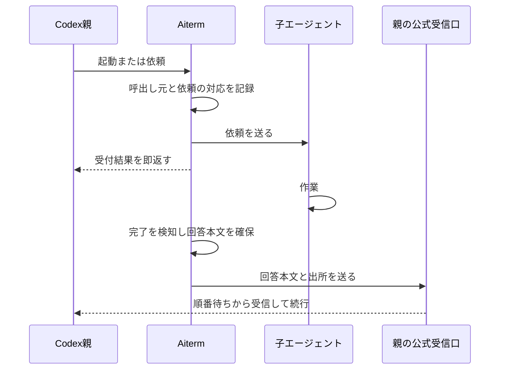

# 子の回答をCodex親へ自動配送する設計・実装計画

状態: 設計案。Codex親から先に対応する方針はオーナー合意済み。製品実装は未着手。

作成: 2026-09-10

関連: [現行設計](DESIGN.md)、[公開工程](RELEASE.md)、[従来の非ブロック契約](adr/0017-non-blocking-dispatch-guidance.md)

## 1. 到達点

Codex親がAitermへ子の仕事を依頼すると、Aitermが完了を検知して回答本文を親へ届ける。
親は別の仕事を続けるかターンを終え、届いた回答で続行する。
通常利用では親による `aiterm-wait` の起動、完了確認のポーリング、回答を取りに行くtool callを必要としない。
子に送信コマンドを実行させる指示も不要にする。

親への通常の完了報告は順番待ちとする。親の受信ターンを指定しない。
待機中なら親の処理が始まり、実行中なら現在のターン終了後に受け取る。
完了報告による割込みは今回追加しない。

今回の対象はCodex親だけ。Claude Code親への自動配送は後続の作業へ分け、今回の成立条件に含めない。
子はAitermが現在扱う各harnessを対象にし、Claude Codeの子も含める。
親の種類と子のharnessを別々に扱う。Desktop独自のtool・IPCには依存しない。
既存の通常HOME、認証、MCP、plugin、skill、permission設定を使う。

## 2. 確認できたことと未確認のこと

| 項目 | 根拠・状態 |
| --- | --- |
| Codexへの外部送信 | 公式 `codex queue` から既存の親へ本文を投入できた |
| Codex CLIの受信 | 待機中のCLIが別processからのキュー投入を受け、自動で新しい回答を生成した |
| この調査を行う親の受信 | 投入した本文が順番待ちに表示され、親のターン終了後にモデル入力として届いた |
| Aitermの子から親への一往復 | 子自身が公式CLIを一度実行し、その本文で親が自動再開した。自動配送の製品実装は含まない |
| Codexの宛先取得 | 対象ソースではモデルのMCP呼出しに `_meta.threadId` を付ける。Aitermでの受取りは実装時に実測する |
| Aitermの既存実装 | 完了観測と回答回収はある。親への配送管理はない |

この実測時のCodex CLIは0.154.0。
CodexのDesktopに同梱されたruntimeは0.153.4だった。
これらは試験時の記録であり、最低対応版の決定ではない。

## 3. 構成

配送処理はAitermのMCP process内で動かす。
既存のharness別完了観測を使い、親のtool call終了後も処理を継続する。
親に起動させる待機processや、新しい常駐daemonは追加しない。

役割は以下に分ける。

| 所有箇所 | 責務 |
| --- | --- |
| `src/index.ts` | CodexのMCP呼出し元情報を取り出し、配送先を依頼へ渡す |
| `src/core.ts` と `src/harnesses/` | 既存の入力・完了判定を使い、完了した依頼の回答本文を取得する |
| 新設 `src/parent-delivery.ts` | 依頼との対応、完了観測、本文の確保、配送状態を管理する |
| 新設 `src/codex-parent-receiver.ts` | Codexの公式受信キューへの送信だけを扱う |
| `src/agent-shared.ts` | 既存相関情報と配送記録の型・保存処理 |
| `src/setup.ts`／`src/setup-integrations.ts` | Codexの対応条件と、公式受信キューを利用できることの確認 |

配送管理から既存coreを利用する。harness moduleへ親の配送方法を持ち込まない。
既存の `state-root.ts` が定めるAiterm所有領域へ状態を置く。
外部ツールの管理領域に独自の配送ファイルを書かない。

## 4. 親と回答の対応

### 宛先

宛先は子へ依頼したMCP呼出しから決める。
親モデルにsession IDや配送コマンドを組み立てさせる公開パラメータは追加しない。

- Codex: MCP要求の `_meta.threadId` を使う。同じ実行環境のCodex設定・storeに対して配送する。
- 既存の `parent_session_id=host-root` はlineage表示であり、配送先として使わない。
- 環境変数だけからCodexの宛先を決めない。複数の親からの呼出しを混同しないよう、呼出し単位のmetadataを使う。
- 以後の `pty_send` も、その依頼を行った親へ返す。実行中の依頼の宛先は後続の操作で書き換えない。

Codex親と判定した呼出しで宛先・受信条件を確認できなければ、子へ仕事を送る前に原因付きで返す。
利用AIへ代替経路の選択を委ねない。Claude Code親など今回の対象外の呼出しには、
既存の待機・明示回収契約を維持し、自動配送を案内しない。

### 回答

同じ子を繰り返し使うため、完了した依頼の本文を確保してから配送する。
親のターンを固定する機構は作らない。

既存の `launch_id`、完了境界、harnessの `turn_id`、Claudeの `operation_id` を使って、
依頼と完了を対応付ける。新しい並行ターン制御は作らない。
初手が即完了する場合も取りこぼさないよう、送信前に配送先と観測開始位置を保存する。

現在の `readAgentTranscriptResult()` は直近の回答を選び、出力削減も行う。
配送用には既存の本文読取りを小さく分離し、対象の完了情報を渡して未削減の本文を得る。
「最新の回答」を後から読み直して配送本文を決めない。
Claudeの現在の結果ファイルはlaunchごとに上書きされるため、次の依頼で置換される前に本文を確保する。
必要な保存時点をStop記録と共通完了処理で確認する。

送るものは確定した回答本文、子のsession名、harness、依頼の識別情報、終了状態。
思考、画面ログ、元のpromptを付けない。要約モデルは追加しない。
親へは子の結果であると明示し、ユーザーからの新しい指示と取り違えない文面にする。

## 5. 受信口

### Codex

実測した `codex queue` の内部は公開app-serverの `thread/queue/add` を使っている。
宛先threadを別processでresumeする必要はない。

製品の送信には同じ公開APIを使い、本文をJSONとしてstdinへ渡す構成を第一候補とする。
理由は、回答全文を `--message` のコマンドライン引数に載せるとOSの引数長上限が配送上限になるため。
公式 `codex app-server --stdio` を短時間起動し、initialize、queue/add、応答確認、終了をAitermが行う。
常駐daemonを前提にせず、ユーザーの通常の設定と認証を使う。

このAPI構成自体は未実測なので、最初の工程でCLIの一往復と同じ挙動を確認する。
既存親のthreadをload／resumeせず投入すること、idle／busy双方の受信、
別CODEX_HOMEの混同防止、長文、process終了を確認して採否を決める。
採用後にCLIとAPIを本文サイズで使い分ける構造は作らない。

queue/addの応答はキューへの受付を意味する。モデルによる処理完了とは区別する。
同じ送信を再実行した場合の受信口の重複排除は、実測するまで保証に含めない。

### 後続のClaude Code親対応

Claude Code親の受信方式と導入条件は、後続の設計で扱う。
今回、Channelsの実装・有効化・起動方法の変更は行わない。
Codexの配送実装に、未実装の親を想定したadapter登録機構は追加しない。

## 6. 配送状態と失敗

記録する最小単位は一つの依頼と、その回答の配送である。
依頼に既存の識別情報を使い、複数の配達管理機構を重ねない。

1. `waiting`: 子へ依頼済みで完了待ち。
2. `ready`: 完了情報と本文を保存済み。
3. `sending`: 外部受信口への送信を開始した。
4. `submitted`: 受信口の契約に従った送信結果を記録した。
5. `failed`／`unknown`: 明確な失敗／送れたか不明。原因と本文を保持する。

`submitted` はCodexのキュー受付を意味し、モデル処理済みと表現しない。
通常の一回の配送を重複起動しない。送信と結果記録の間でprocessが終了した場合は、
受信口の重複排除が確認できない限り自動で再送しない。

未送信の保存済み回答は、同じ親の受信口へ再接続できたと確認してから配送する。
宛先を別の親へ置換しない。MCP process再起動・親の会話切替・明示的なPTY closeを試験に含める。
送信前の本文をPTY closeで消してしまわないよう、配送記録の寿命を子の画面ログと分ける。

APIエラー・利用上限・子の異常終了には成功回答を作らず、終了状態と理由を親へ送る。
親へ送れない場合は配送記録と既存の観測APIに状態を残す。
診断集計へ本文・認証情報・生stderrを載せない。
正常実行中の子は固定600秒で配送終了にせず、完了または明示的終了まで観測する。

長文の受信上限はCodexの受信口で実測して決める。
超過時に無断で要約・末尾切落し・ファイル参照だけへの置換をしない。
送れない本文は保持し、サイズ超過として明示する。

## 7. 公開APIと移行

- Codex親による `agent_launch(prompt=...)`、agentへの `pty_send`、MCPからの `claude_turn issue` へ配送を接続する。
  `claude_turn issue` はClaudeの子への依頼であり、Codex親への返答として扱う。
- promptなしlaunchは子を起動するだけ。実際の依頼時に配送を登録する。
- 旧launcher aliasは標準入口と同じ動作を使う。
- `agent_steer` は既存の子への追加指示として維持する。親への配送を新規登録しない。
- receiptに自動配送の状態を追加し、Codex親の対応した経路では `wait_process`／`wait_command` をnullにする。
  descriptionはCodex親の自動配送と、それ以外の親の既存手順を明示する。
- `pty_read` は画面確認・手動調査・失敗時の明示的回収に残す。配送状況も既存の観測面で確認できるようにする。
- 自動配送のためだけの新しい公開toolは増やさない。
- `aiterm-wait` はCodex親の通常経路から外す。Claude Code親や既存machine callerが使うためbinaryは維持する。
  Codexの自動配送の裏で起動する構成にはしない。
- AI親を持たないcore API利用者やClaude Codeなど他の親harnessには、既存の待機・明示回収契約を維持する。
  Codexの自動配送失敗を隠すために、この契約へ切り替えない。

公開挙動を実装するcommitで日英README、DESIGN、関連ADR、CHANGELOG、必要な配布metadataを同期する。
本計画は設計案なので、現行契約はまだ書き換えない。

## 8. 実装順序と受入

| 工程 | 作業 | 終了条件 |
| --- | --- | --- |
| 1. 公式受信口の成立確認 | CodexのMCP metadataとqueue/add経路を小さな試験で確認する | Codexの最小構成・対応条件・受信挙動を実測で決定できる |
| 2. 本文と配送先の保持 | 呼出し元を依頼へ対応付け、既存完了情報から本文を確保する | 同じ子への連続依頼、別の親、即完了でも本文と宛先が一致する |
| 3. 自動配送の接続 | MCP process内の配送管理とCodexへの送信を加え、receiptとsetupを接続する | Codex親がwait起動も回収もせず、子の確定回答を受信して続行する |
| 4. 移行・公開 | 既存消費者を確認し、案内・文書・配布物を更新する | 関連試験、製品CI、release・導入・公開後smokeが成立する |

Codex親だけで本計画の実装・検証・releaseを完結する。Claude Code親対応の成立待ちは設けない。
実装着手時の作業レーンは、その時点の受入・外部依存に従って決定する。Latticeの新規導入は含めない。

focused testは以下に絞る。

- 一つのMCP processへ異なる親の呼出しを与え、宛先が混ざらない。
- 子の即完了、初手、follow-up、同じ子の連続回答で、それぞれの本文を一度ずつ配送する。
- 次の回答が保存された後も、確保済みの前の回答が変化しない。
- 日本語・改行・引用符・長文をJSONで往復し、受信本文が一致する。
- Codexの不明な宛先、未対応runtime、明確な送信拒否、送信結果不明を成功へ丸めない。
- MCP再接続、会話切替、明示closeで、誤配送と無断再送がない。
- APIエラー・利用上限・中断の状態通知を成功回答と区別する。
- Claude Code親の既存待機・回収、直接core利用、画面確認、agentへのsteerを壊さない。

実機ではCodex CLI親を必須とし、Codex Desktop親も同じ共通経路で確認する。
子のharnessごとの完了回収はfocused testで先に確認し、親の配送試験へ進む。
macOS・Linux・Windows nativeで、Codex親の通常登録から一往復を行う。
通常利用の受入では、子のpromptに返送コマンドを含めない。

個別検証と関連gate完了後に `npm test` を一度行う。
公開工程は[RELEASE](RELEASE.md)のmain祖先gate、製品CI、公開、導入、公開後smokeに従う。
今回の計画作成では文書と取り込んだ資料だけを検証し、製品の通し試験・公開は行わない。

## 9. 根拠

取得・確認日: 2026-09-10。ソース確認と実機確認を上表で区別した。

- [Codex公式app-server説明](https://learn.chatgpt.com/docs/app-server): stdioを含む公開接続方式。
- [取り込んだCodex queue入口](../rag/sources/completion-detection/codex-0154-session-queue.md): 版を固定した公式ソース。
- [取り込んだCodex受信キュー](../rag/sources/completion-detection/codex-0154-queue-service.md): 別processからの投入とidle時の開始。
- [取り込んだCodex MCP metadata](../rag/sources/completion-detection/codex-0154-mcp-call-metadata.md): 呼出し元thread IDの付与。
